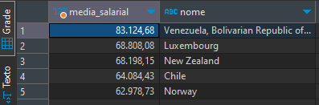

## Desafio AmeDigital

Desafio baseado no [challenge-data-engineer - AmeDigital](https://github.com/AmeDigital/challenge-data-engineer).

O desafio se resume em duas partes:

1. Popular um banco de dados a partir dos dados disponibilizados
2. Realizar consultas no banco de dados

### Sumário

1. [Objetivos](#objetivos)
2. [Resumo](#resumo)
3. [Respostas SQL](#respostas-sql)
4. [Execução](#execução)


### Objetivos

Foi disponibilizado um arquivo em formato ```.csv``` com dados referentes a parte de uma pesquisa feita pelo Stack Overflow. Esses dados, junto ao seu dicionário, podem ser encontrados no link acima.

Também foi disponibilizado a modelagem do banco de dados.

O objetivo é utilizar alguma linguagem de programação para fazer a inserção no banco de dados e depois realizar algumas consultas sql para sanar algumas dúvidas. 

O tratamento dos dados deve seguir algumas regras já estabelecidas pelo desafio, sendo elas:
* Salário vazio ou com valor "NA" deve ser convertido para zero (0.0).
* Salário deve ser sempre calculado em reais e mensal. Para esse cálculo você usará a coluna ConvertedSalary, que contém o salário anual. Considere que 1 dólar equivale a R$3,81.
* O nome dos respondentes deve seguir a regra respondente_[número] . (ex: respondente_1, respondente_2, respondente_3). O critério de geração desse número é todo seu.
* Cada linha da tabela linguagem_programacao deve conter uma única linguagem de programação.
* Cada linha da tabela ferramenta_comunic deve conter apenas uma ferramenta de comunicação.
* Quebrar a string nos pontos que existem ponto-e-vírgula (";")

### Resumo

Tecnlogias utilizadas:
* Linguagem de programação: ```Python 3.8```
* Banco de dados: ```Postgresql 13```
* Biblioteca para conexão com banco de dados: ```SQL Alchemy```

Arquivos:
* ```/app/models``` contem os modelos dos objetos.
* ```/app/db_session.py``` faz a conexão com o banco de dados.
* ```/app/index.py``` faz todo o tratamento dos dados. 
* ```/app/insert.py``` faz a inserção no banco de dados.
* ```/app/main.py``` arquivo a ser executado.

Para execução, foi utilizado ```Docker``` para isolar o ambiente de desenvolvimento e persistir o banco de dados.

### Respostas SQL

[Arquivo consultas .sql](docs/amedigital.sql)

1. Qual a quantidade de respondentes de cada país?


2. Quantos usuários que moram em "United States" gostam de Windows?


3. Qual a média de salário dos usuários que moram em Israel e gostam de Linux?


4. Qual a média e o desvio padrão do salário dos usuários que usam Slack para cada tamanho de empresa disponível?


5. Qual a diferença entre a média de salário dos respondentes do Brasil que acham que criar código é um hobby e a média de todos de salário de todos os respondentes brasileiros agrupado por cada sistema operacional que eles usam?


6. Quais são as top 3 tecnologias mais usadas pelos desenvolvedores?


7. Quais são os top 5 países em questão de salário?


8. Quantos usuários ganham mais de 5 salários mínimos em cada um desses países.


### Execução

1. Modifique o arquivo ```.env``` com os dados para conexão com banco de dados
2. Certifique-se que tenha o ```Docker``` e o ```docker-compose``` instalado
3. No mesmo diretório do arquivo ```docker-compose.yaml``` execute o comando ```docker-compose up```