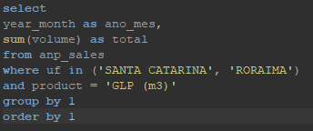

## ANP Fuel Sales ETL Test

Desafio baseado no [data-engineering-test - raizen-analytics](https://github.com/raizen-analytics/data-engineering-test/blob/master/TEST.md).

O desafio se resume em:

* Fazer o ETL dos dados sem perder a consistencia. Ou seja, os filtros devem
mostrar os mesmos resultados do arquivo original


### Sumário

1. [Objetivos](#objetivos)
2. [Resumo](#resumo)
3. [Comparando os dados](#comparando-os-dados)
4. [Execução](#execução)


### Objetivos

Foi disponibilizado um arquivo em formato ```.xls``` com dados da ANP (Agência Nacional do Petróleo, Gás Natural e Biocombustíveis). Esse arquivo contem várias tabelas dinâmicas.

Os dados devem ser extraídos para uma única tabela, com o seguinte schema:

| Column     | Type      |
|------------|-----------|
| year_month | date      |
| uf         | string    |
| product    | string    |
| unit       | string    |
| volume     | double    |
| created_at | timestamp |

Os totais dos dados extraídos devem ser iguais aos totais das tabelas dinâmicas.


### Resumo

Tecnologias utilizadas:
* Linguagem de programação: ```Python 3.8```
* Banco de dados: ```Postgresql 13```
* Biblioteca para conexão com banco de dados: ```SQL Alchemy```

Arquivos:
* ```/app/db.py``` faz a conexão com o banco de dados.
* ```/app/functions.py``` faz todo o tratamento dos dados. 
* ```/app/main.py``` arquivo a ser executado.

Para execução, foi utilizado ```Docker``` para isolar o ambiente de desenvolvimento e persistir o banco de dados.

### Comparando os dados
```
Filtros:
ESTADOS: Todos | COMBUSTIVEL: Todos
```
 
 


```
Filtros:
ESTADOS: ESPIRITO SANTO | COMBUSTIVEL: Todos
```
 
 


```
Filtros:
ESTADOS: SANTA CATARINA e RORAIMA | COMBUSTIVEL: GLP (m3)
```
 
 

### Execução

1. Modifique o arquivo ```.env``` com os dados para conexão com banco de dados
2. Certifique-se que tenha o ```Docker``` e o ```docker-compose``` instalado
3. No mesmo diretório do arquivo ```docker-compose.yaml``` execute o comando ```docker-compose up```