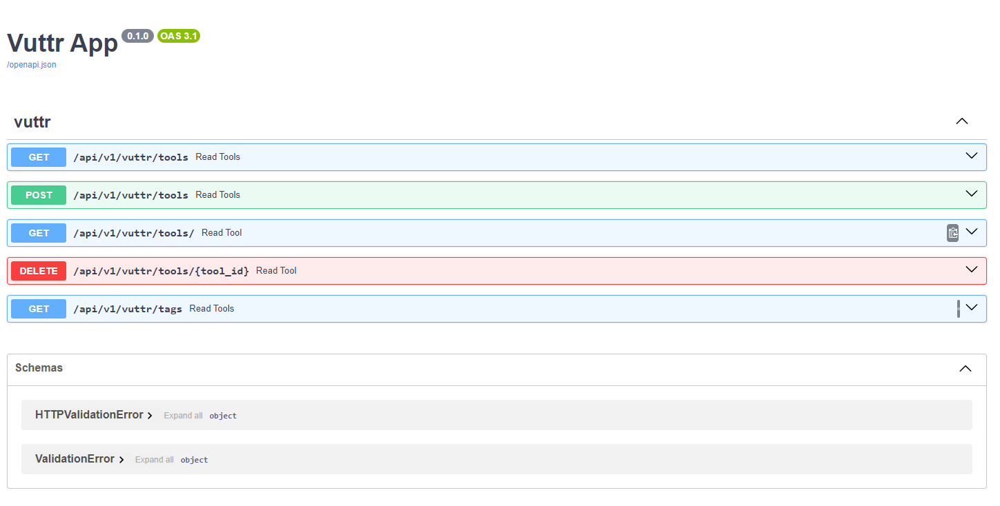

# Documentação da API REST para Gerenciamento de Ferramentas

Esta API permite aos usuários listar, buscar, cadastrar e remover ferramentas.

## Endpoints

### `GET /tools`

#### Descrição

Este endpoint retorna todas as ferramentas cadastradas.

#### Exemplo de Resposta

```json
[
    {
        id: 1,
        title: "Notion",
        link: "https://notion.so",
        description: "All in one tool to organize teams and ideas. Write, plan, collaborate, and get organized. ",
        tags: [
            "organization",
            "planning",
            "collaboration",
            "writing",
            "calendar"
        ]
    },
    {
        id: 2,
        title: "json-server",
        link: "https://github.com/typicode/json-server",
        description: "Fake REST API based on a json schema. Useful for mocking and creating APIs for front-end devs to consume in coding challenges.",
        tags: [
            "api",
            "json",
            "schema",
            "node",
            "github",
            "rest"
        ]
    }
]
```


### `GET /tools?tag=node`

#### Descrição

Este endpoint retorna todas as ferramentas cadastradas que contém a tag informada.

#### Exemplo de Resposta

``` json
[
    {
        id: 2,
        title: "json-server",
        link: "https://github.com/typicode/json-server",
        description: "Fake REST API based on a json schema. Useful for mocking and creating APIs for front-end devs to consume in coding challenges.",
        tags: [
            "api",
            "json",
            "schema",
            "node",
            "github",
            "rest"
        ]
    },
    {
        id: 3,
        title: "fastify",
        link: "https://www.fastify.io/",
        description: "Extremely fast and simple, low-overhead web framework for NodeJS. Supports HTTP2.",
        tags: [
            "web",
            "framework",
            "node",
            "http2",
            "https",
            "localhost"
        ]
    }
]
```

### `POST /tools`
### `Content-Type: application/json`

#### Descrição

Este endpoint cadastra uma nova ferramenta

#### Exemplo de Requisição

``` json
{
    "title": "hotel",
    "link": "https://github.com/typicode/hotel",
    "description": "Local app manager. Start apps within your browser, developer tool with local .localhost domain and https out of the box.",
    "tags":["node", "organizing", "webapps", "domain", "developer", "https", "proxy"]
}
```

#### Exemplo de Resposta

``` json
{
    "title": "hotel",
    "link": "https://github.com/typicode/hotel",
    "description": "Local app manager. Start apps within your browser, developer tool with local .localhost domain and https out of the box.",
    "tags":["node", "organizing", "webapps", "domain", "developer", "https", "proxy"]
}
```

### `DELETE /tools/:id`

#### Descrição

Este endpoint deleta a ferramenta pelo id informado.

#### Exemplo de Resposta

``` json
{}
```

